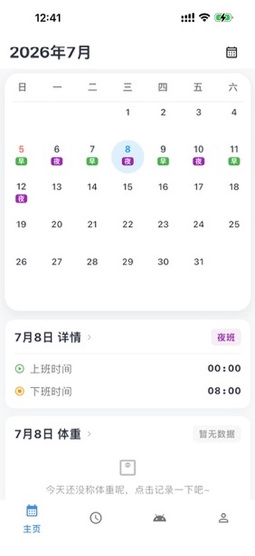
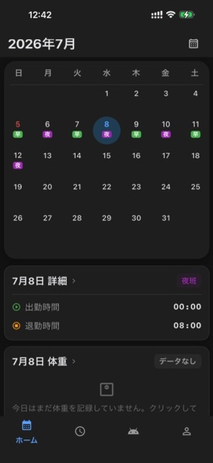
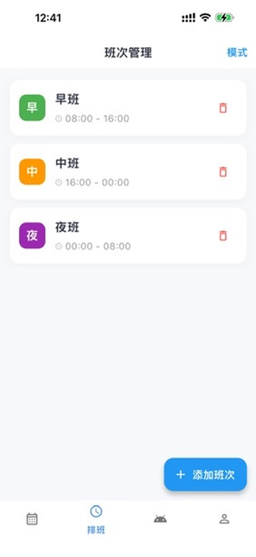
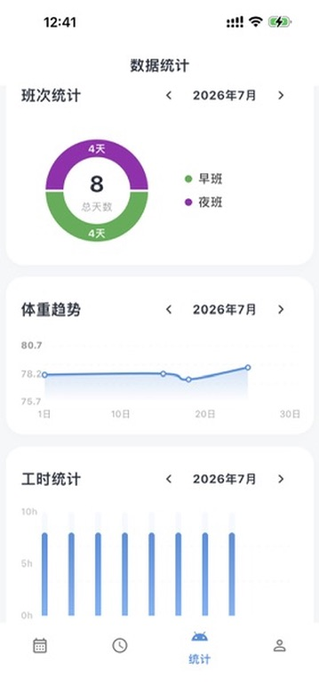
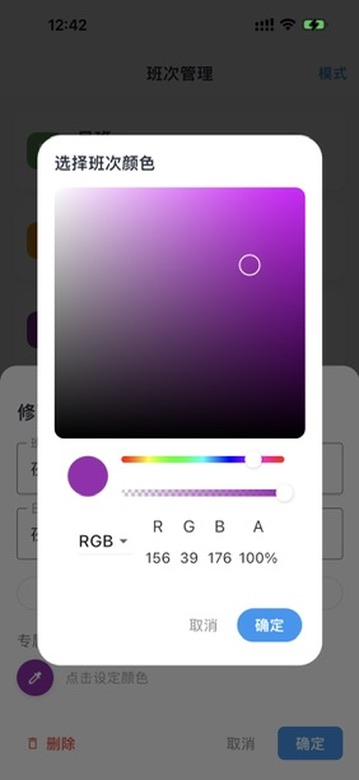
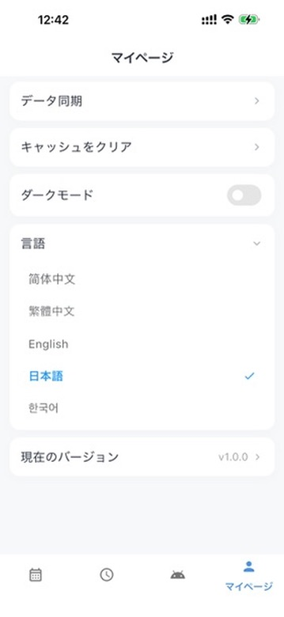

# Flutter Calendar & Health (班表与健康助手)

一个集成了专业**班表管理**、**系统原生深度同步**与**智能健康监控**的 Flutter 高质量应用。专为倒班、轮班人群量身定制，通过极致的 Native 交互与现代化的技术栈，实现工作计划与身体健康的一站式管理。

## 🌟 核心功能

### 1. 班表管理 (Professional Shift Management)
- **自定义班次体系**：自由配置班次名称、颜色标识、工作时长、休息时间及备注。
- **智能排班引擎**：
  - **周期性规律排班**：支持“四班三倒”、“两班倒”等任意长周期的排班序列。
  - **固定周模式**：按周循环设定（如常规 996 或固定周末双休）。
  - **一键批量生成**：指定日期范围，秒级生成长达数年的排班计划。
- **极致可视化日历**：丝滑的月份切换动画，日历格不仅展示班次，还同步显示当日是否有健康测量数据。

### 2. 系统原生深度集成 (Hardcore Native Integration) 🔥
- **iOS 灵动岛与实时活动 (Live Activities)**：
  - 深度适配 iOS **灵动岛 (Dynamic Island)**。
  - 锁屏界面实时显示当前班次进度、剩余工作时长，无需解锁手机。
- **智能提醒系统**：
  - **自动化 7 天同步**：后台自动计算未来 7 天的排班，并精准同步至**系统闹钟/通知**。
  - **系统日历双向同步**：支持一键将排班表导出至 iOS/Android 原生日历应用。
- **Pigeon 类型安全通信**：底层采用 Pigeon 方案，确保 Dart 与原生（Swift/Kotlin）之间的数据交换达到工业级稳定性。

### 3. 智能健康监控 (Smart Health Tracking)
- **蓝牙设备接入 (BLE)**：深度适配 **小米/华米体脂秤 2 (MIBFS)**。
- **自动化测量流**：支持“踩秤即测”，利用 Reactive 机制自动过滤测量过程中的波动，只记录最终稳定的体重与阻抗数据。
- **数据趋势分析**：按日记录多频次测量，自动汇总日平均值，并通过 **fl_chart** 绘制美观的体重变化趋势图。

### 4. 物联网与扩展 (IoT & Extensions)
- **MQTT 数据外发**：支持将实时测量数据同步推送到自定义的 MQTT Broker（如 Home Assistant），方便发烧友接入智能家居生态。
- **极致个性化**：
  - **深色模式 (Dark Mode)**：全界面 1:1 适配暗黑模式。
  - **多语言 (L10n)**：内置完善的中、英、日、韩等多国语言支持。
  - **取色器**：内置 `flutter_colorpicker`，班次颜色任你定义。

## 📸 界面预览

|                    首页预览                    |                 首页预览 (夜间)                  |                    排班管理                    |
|:------------------------------------------:|:------------------------------------------:|:------------------------------------------:|
|  |  |  |

|                    模式设置                    |                    排班生成                    |                    数据统计                    |
|:------------------------------------------:|:------------------------------------------:|:------------------------------------------:|
|  |  |  |

|                    班次编辑                    |                   颜色自定义                    |                   多语言支持                    |
|:------------------------------------------:|:------------------------------------------:|:------------------------------------------:|
|  |  |  |

## 🛠️ 技术栈 (Modern Tech Stack)

- **核心架构**：Flutter (Channel Stable)
- **状态管理**：**Riverpod 2.0** (采用异步生成器 `riverpod_generator`)
- **本地数据库**：**Isar** (高性能、强类型 NoSQL，支持流式监听)
- **原生桥接**：**Pigeon** (类型安全的接口定义语言)
- **传感器与通信**：`flutter_blue_plus` (BLE), `mqtt_client` (IoT)
- **数据可视化**：`fl_chart` (高品质图表库)

## 📂 项目结构

```text
lib/
├── data/          # Isar 数据库模型与实体
├── repository/    # 核心业务逻辑 (BLE 总管, MQTT 总管, 数据库仓库)
├── provider/      # Riverpod 状态提供者与业务处理中心
├── pages/         # 功能页面 UI
├── service/       # 原生通道封装 (Live Activities, Calendar)
├── l10n/          # 多语言资源文件
└── utils/         # 权限控制、日期处理等工具类
```

## 🚀 快速开始

1. **环境**：Flutter SDK `^3.12.0`。
2. **生成代码**（Isar 与 Riverpod 必须步骤）：
   ```bash
   flutter pub get
   flutter pub run build_runner build --delete-conflicting-outputs
   ```
3. **运行**：连接真机测试（Live Activity 和 BLE 必须在真机运行）。

## 📄 许可证

本项目遵循 MIT 许可证。
